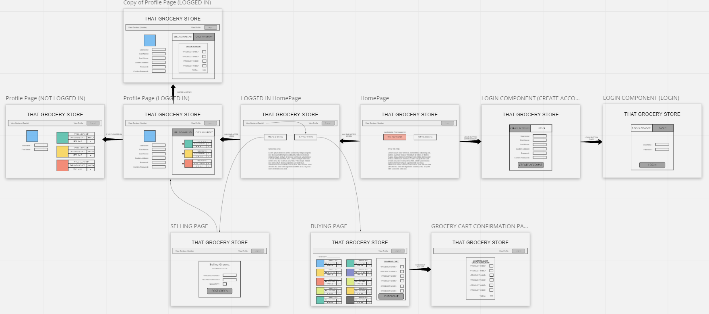
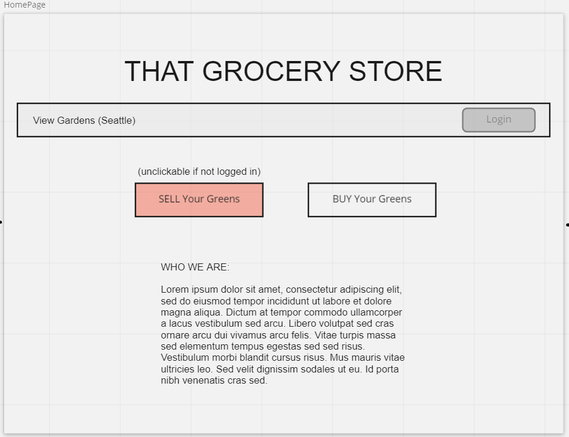
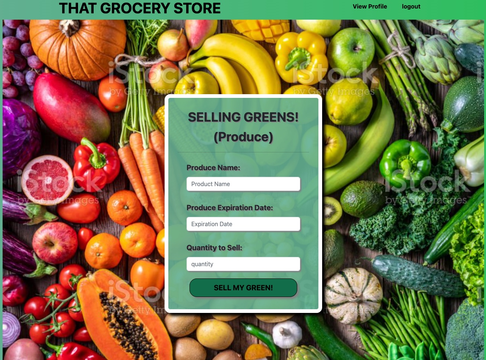

      

# That Grocery Store

## University of Washington, Full Stack Coding Bootcamp

### Group Project #3

### Vladimir Berka, Jesse Crumley, Nathan Kilcrease, Godfrey Bongomin

## TABLE OF CONTENTS

- [Project Description](#project-description)
- [User Story](#user-story)
- [Links](#links)
- [Contributions and Roles](#contributions-and-roles)
- [Screenshot](#screenshot)

## ASSIGNMENT DESCRIPTION

This is a Full Stack Web Development *group project* for the UW Bootcamp. The goal of the project is to create a fully function full stack web application using all technologies learned to date. Particularly those technologies contained within the *MERN* stack (MongoDB, Express, React, Node)

Some technoligies include `HTML`, `CSS`, `JavaScript`, `Bootstrap`, `Node.JS`, `Express.JS`, `.env`, `React.JS`, `JSX`, `Stripe`

This project stresses equal importance between project management and web development. A development process shall be identified and agreed upon to assist with pushing code, pulling code, and merging code conflicts on GitHub. This process shall include the division of labor and tasks.

A mockup / wireframe shall be created by an individual within the project team and used as a visual goal. (`UI/UX`)

A project user story and acceptance criterai shall be created by the project  team and used as a functionality goal (`Product Manager/Owner`)

Project management shall be `Agile` and augmented with `Kanban` style organization: with individual tasks divided, assigned, and tracked.

The group developed user story, acceptance criteria, and mockup for the assignment are copied to the end of this document. 

## PROJECT SCOPE

DIGITAL MARKETPLACE - GROCERIES!!
Create a full stack web page application that allows restaurant customers to view a compilation of vegetables (greens) for sale in their area (by default: Seattle).
This web application allows users to create an account to serve two user bases: consumers who want to purchase goods, and producers who want to sell their goods.
Consumers will be allowed to view and add goods to a shopping cart for final purchase using `Stripe`
Producers will be allowed to add goods for sale

State and storage is handled with React's built in `useState` and `storeContext`

No starting code has been provided - HOWEVER THERE ARE USEFUL EXAMPLES FROM PREVIOUS CLASS ACTIVITIES THAT HAVE SIMILAR FUNCTIONALITY

No guidance, project choices, or project direction has been provided.

# ORIGINAL PROJECT DETAILS

## USER STORY:

```md
AS A consumer
I WANT to buy locally grown produce,
I WANT to see a list of produce online that I can buy,
SO THAT I can eat healthy foods while supporting my community

AS A producer
I WANT to be able to sell my produce to local customers,
I WANT to be able to list and see my produce to sell,
SO THAT I can sell my goods to local consumers

```

## ACCEPTANCE CRITERIA

```md
GIVEN A digital marketplace for buying and selling produce

WHEN I visit the site for the first time
THEN I am presented with options to sell, buy, and view all produce for sale
WHEN I click on "sell your greens" 
THEN I am asked to login if not already
WHEN I click on "sell your greens" & "am logged in"
THEN I am routed to a form to add produce to sell
WHEN I click "SUBMIT" on the form
THEN I am able to see the new produce on the "view all produce" page
WHEN I click on "buy your greens"
THEN I am asked to login if not already
WHEN I click on "buy your greens" & "am logged in"
THEN I am routed to a list of all produce for sale
WHEN I click on "view all produce"
THEN I am am routed to a list of all produce for sale
WHEN I view all produce
THEN I am able to filter based on criteria (category, location, etc)
WHEN I click on produce I wish to purchase
THEN I see it is added to a digital cart
WHEN I click on "PURCHASE" in the cart
THEN I am re-directed to `Stripe` to add my credit card information
```

## MIRO MOCKUPS





## URL TO THE GITHUB REPOSITORY

- [GITHUB](https://github.com/bongomin256/That_Grocery_Store)

## URL TO THE HEROKU HOSTED APPLICATION

- [VIEW LIVE APP](https://that-grocery-store.herokuapp.com/)

## CONTRIBUTIONS AND ROLES

- Vlad Berka: React Components, React Pages, CSS, README, Presentation General De-bugging and assistance w/ others [Github](https://github.com/vlad-berka)
- Godfrey Bongomin: Actions, Auth, GlobalState, Helpers, Queries, Stripe [Github](https://github.com/bongomin256)
- Nathan Kilcrease: Reducers, Models, Schemas, Mongoose [Github](https://github.com/batemanz)
- Jesse Crumley: Mutations, Reducers, Resolvers, TypeDefs, Stripe [Github](https://github.com/crumwj22)

## SCREENSHOT




## License

MIT License

Copyright (c) [2022] [Vlad Berka, Jesse Crumley, Nathan Kilcrease, Godfrey Bongomin]

Permission is hereby granted, free of charge, to any person obtaining a copy
of this software and associated documentation files (the "Software"), to deal
in the Software without restriction, including without limitation the rights
to use, copy, modify, merge, publish, distribute, sublicense, and/or sell
copies of the Software, and to permit persons to whom the Software is
furnished to do so, subject to the following conditions:

The above copyright notice and this permission notice shall be included in all
copies or substantial portions of the Software.

THE SOFTWARE IS PROVIDED "AS IS", WITHOUT WARRANTY OF ANY KIND, EXPRESS OR
IMPLIED, INCLUDING BUT NOT LIMITED TO THE WARRANTIES OF MERCHANTABILITY,
FITNESS FOR A PARTICULAR PURPOSE AND NONINFRINGEMENT. IN NO EVENT SHALL THE
AUTHORS OR COPYRIGHT HOLDERS BE LIABLE FOR ANY CLAIM, DAMAGES OR OTHER
LIABILITY, WHETHER IN AN ACTION OF CONTRACT, TORT OR OTHERWISE, ARISING FROM,
OUT OF OR IN CONNECTION WITH THE SOFTWARE OR THE USE OR OTHER DEALINGS IN THE
SOFTWARE.